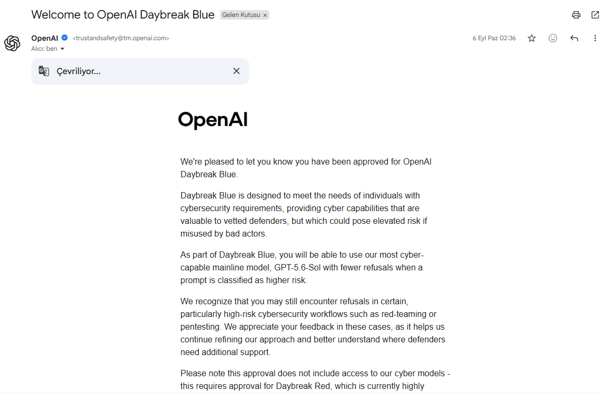

# Iamrabbyte

Independent Security Researcher focused on offensive web security, API security, authentication, authorization, and evidence-driven validation.

The research below documents vulnerabilities and security weaknesses I personally identified, validated, and documented during authorized assessments of real-world web applications and APIs.

## Selected Research

- [Account Recovery Bypass](https://github.com/Iamrabbyte/security-research-portfolio/blob/main/case-studies/account-recovery-bypass.md)
- [Cross-Tenant Authentication](https://github.com/Iamrabbyte/security-research-portfolio/blob/main/case-studies/cross-tenant-authentication.md)
- [WebSocket Credential Exposure](https://github.com/Iamrabbyte/security-research-portfolio/blob/main/case-studies/websocket-credential-exposure.md)
- [AVIF / Next.js Security Validation](https://github.com/Iamrabbyte/security-research-portfolio/blob/main/case-studies/avif-security-validation.md)

Each public case study is sanitized to remove target-specific secrets, credentials, user data, and reusable exploitation details.

## Evidence

The portfolio includes separate redacted validation records preserving technical observations such as negative controls, HTTP state transitions, authentication behavior, revalidation results, and impact boundaries.

- [Account Recovery Validation Evidence](https://github.com/Iamrabbyte/security-research-portfolio/blob/main/evidence/account-recovery-validation-redacted.md)
- [Cross-Tenant Validation Evidence](https://github.com/Iamrabbyte/security-research-portfolio/blob/main/evidence/cross-tenant-validation-redacted.md)
- [WebSocket Validation Evidence](https://github.com/Iamrabbyte/security-research-portfolio/blob/main/evidence/websocket-validation-redacted.md)
- [AVIF Validation Evidence](https://github.com/Iamrabbyte/security-research-portfolio/blob/main/evidence/avif-validation-redacted.md)

An additional redacted private acknowledgement is preserved in the portfolio as supporting context for a real-world research interaction.

It is not presented as formal vendor acceptance or as technical proof of any individual vulnerability.

## Trusted Access

### OpenAI Daybreak Blue

I was approved for OpenAI Daybreak Blue for authorized cybersecurity workflows.

A redacted copy of the approval confirmation is included below. Account-specific and recipient details have been removed.

This confirms Daybreak Blue access only and is not presented as Daybreak Red access or approval.

## Security Tools

### JWT Context Inspector

A lightweight Python CLI for reviewing JWT header and payload context during authorized security assessments.

It highlights claims such as:

- issuer
- subject
- audience
- expiration
- tenant identifiers

The tool also performs lightweight security-oriented review of JWT metadata, including:

- `alg: none`
- `kid`
- `jku`
- `x5u`
- expired tokens
- future `nbf`
- unusually long token lifetimes
- missing issuer, audience, and tenant-binding context

The project includes automated tests and GitHub Actions CI.

- [View jwt-context-inspector](https://github.com/Iamrabbyte/jwt-context-inspector)

## Sample Pentest Report

- [Sanitized Penetration Test Report](https://github.com/Iamrabbyte/security-research-portfolio/blob/main/sample-pentest-report.md)

## Offensive Security Focus

- Web application penetration testing
- API security
- Authentication and authorization testing
- Access control and privilege boundaries
- Account recovery and identity flows
- JWT and session security
- Multi-tenant isolation
- WebSocket and real-time application security
- Vulnerability validation
- Impact calibration
- Remediation and revalidation

## Approach

I focus on reproducible evidence rather than scanner-only findings.

My typical workflow:

1. Define scope and safety boundaries
2. Establish a baseline or negative control
3. Map relevant application and API behavior
4. Investigate anomalous behavior
5. Reproduce suspected security weaknesses
6. Validate impact using authorized synthetic accounts or test data
7. Separate confirmed behavior from theoretical exploitability
8. Restore modified test state where applicable
9. Document remediation guidance
10. Revalidate findings when possible

## Evidence Standards

I distinguish between:

- observed behavior
- confirmed security impact
- conditional impact
- theoretical exploitability
- historical findings that are no longer reproducible

Where higher-impact exploitation cannot be safely demonstrated, I document it as unconfirmed rather than presenting theoretical impact as proven.

## Evidence Handling

Public research intentionally excludes sensitive operational material such as:

- target domains and URLs
- credentials
- session tokens
- cookies
- passwords
- verification values
- real user information
- exact exploit inputs
- sensitive endpoint details
- reusable attack material

The goal is to make the methodology and validation logic reviewable without exposing target-specific secrets.

## Responsible Testing

All published case studies are based on systems I was explicitly authorized to assess.

Testing documented in the portfolio avoids unnecessary impact and does not include destructive testing, denial-of-service activity, persistence, or unauthorized access to real-user data.

## Portfolio

[View the full Security Research Portfolio](https://github.com/Iamrabbyte/security-research-portfolio)
